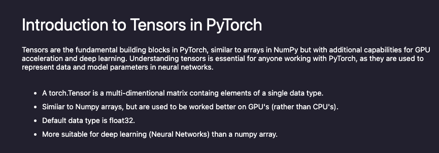

# pytorch-basic-nn


---

## Introduction

A beginner-friendly PyTorch tutorial and learning resource. This project helps you (and others) learn the basics of PyTorch by building, training, and evaluating neural networks from scratch.

---

## Description

This repository provides clear, hands-on examples and explanations for using PyTorch. It covers:
- Tensor basics and operations
- Building and training a simple neural network (Iris dataset)
- Building and training a CNN (MNIST dataset)
- Model evaluation, visualization, and saving/loading

Whether you are new to deep learning or want a practical tutorial, this repo walks through the essential steps of using PyTorch for neural networks.

---

## Visuals



---

## Prerequisites / Requirements

- Python 3.10+
- [PyTorch](https://pytorch.org/) (see [Apple Silicon instructions](https://pytorch.org/get-started/locally/) if on Mac M1/M2/M3/M4)
- NumPy
- (Optional) Conda
- (Optional) Jupyter Notebook

---

## Technologies Used

- PyTorch
- NumPy
- Pandas
- Matplotlib
- scikit-learn
- torchvision

---

## QuickStart Guide

```bash
# (Recommended) Create a new environment
conda create -n pytorch python=3.10
conda activate pytorch

# Install dependencies
pip install -r requirements.txt

# (Optional) For Apple Silicon, use:
pip3 install torch torchvision torchaudio

# Run notebooks
jupyter notebook

# Or run the training script
python src/train.py
```

---

## Advanced Usage

- Try different architectures in the notebooks (e.g., add more layers, change activation functions)
- Experiment with hyperparameters (learning rate, batch size, epochs)
- Use your own datasets by modifying the data loading sections
- Save and load models for inference or further training

---

## Configuration

- All configuration is done in the notebooks or `src/train.py`
- For custom datasets, update the data loading paths and preprocessing steps
- No API keys or private tokens required

---
<!-- 
## Automated Tests

Run all tests with:

```bash
pytest tests/
```

--- -->

## Roadmap

- [x] Basic tensor operations notebook
- [x] Simple neural network (Iris)
- [x] CNN example (MNIST)
- [ ] Add more activation functions
- [ ] Add data augmentation examples
- [ ] Add model export to ONNX
- [ ] Add more advanced PyTorch features (e.g., custom datasets, callbacks)

---

## Folder Structure

```
pytorch-basic-nn/
├── src/
│   ├── 1_Tensors.ipynb
│   ├── 2_Tensor_Operations.ipynb
│   ├── 3_Tensor_Math.ipynb
│   ├── 4_Simple_NeuralNetwork.ipynb
│   ├── 5_CNN.ipynb
├── docs/
│   └── Intro.png
├── requirements.txt
├── .gitignore
├── LICENSE
└── README.md
```

---

## Contribution

Contributions are welcome! Please see [CONTRIBUTING.md](CONTRIBUTING.md) for guidelines.

- Open an issue for bugs or feature requests
- Fork the repo and submit a pull request
- Follow code style and add tests where appropriate

---

## License

MIT License

---

## FAQ / Troubleshooting

- **Q:** How do I install PyTorch on Mac Apple Silicon?
  **A:** Use the official [PyTorch instructions for Apple Silicon](https://pytorch.org/get-started/locally/), or run:
  ```
  pip3 install torch torchvision torchaudio
  ```

- **Q:** Where do I start?
  **A:** Open the notebooks in `src/` and follow them in order for a guided learning experience.

---
